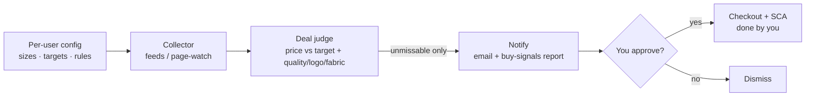

# dealScout

> Personal bargain-hunting wardrobe assistant. Watches a curated list of quality menswear, judges when a price is *genuinely* unmissable, and emails a buy-signal — you approve and check out yourself.

**Status:** 🚧 scaffold (v1 in progress) · **Type:** personal tool, multi-user-ready · part of [NauroLabs](https://naurolabs.com)

## What it does

dealScout is a **co-pilot, not an autopilot**:

1. **Watches** product pages / feeds for the items on your list.
2. **Judges** each price against your targets **and** your quality / logo / fabric rules — surfacing only the *"can't-say-no"* deals.
3. **Notifies** you by email + a buy-signals report you review in VS Code; **you** complete checkout (EU Strong Customer Authentication requires a human anyway).

It never buys unattended and never stores card details.



## Architecture

- **Engine** (this repo) — shared logic; knows nothing about any specific user.
- **Config** (per-user) — sizes, targets, watch-list, quality rules. Lives **outside** the repo (owner's private vault); [`config.example.yaml`](config.example.yaml) shows the shape. Copy it to `config.local.yaml` (git-ignored).
- **Personal-first, multi-user-ready:** adding a person = adding a config, not changing code.

## Quick start

```bash
python -m venv .venv && . .venv/Scripts/activate   # Windows: .venv\Scripts\Activate.ps1
pip install -r requirements.txt -r requirements-dev.txt
cp config.example.yaml config.local.yaml           # then edit your watch-list
python -m dealscout.run
pytest -q
```

## Configuration

See [`config.example.yaml`](config.example.yaml) — encodes target sizes, fit-by-context, the logo rule, natural-fibre threshold, per-category "can't-say-no" prices, the brand shortlist, and the watch-list. Email is configured via env (see [`.env.example`](.env.example)); never commit real addresses or secrets.

## Roadmap

- **v1 (now):** cron → page-watch/feeds → deal judge → email + report. Detect-and-notify only.
- **Later:** affiliate feeds (Awin) to cut scraping · Telegram notifications · Cosmos-backed multi-user config · a small web onboarding page for family/friends.

## Guardrails

- **No unattended auto-buy** — SCA + ToS + fraud risk.
- **No payment credentials** in this repo, ever.
- **Prefer feeds over scraping**; scrape only your own watch-list pages, politely.
- **Never hardcode a user** — brands, sizes, contacts live in config, not code.
